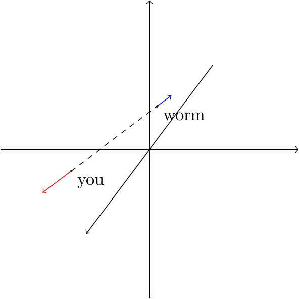
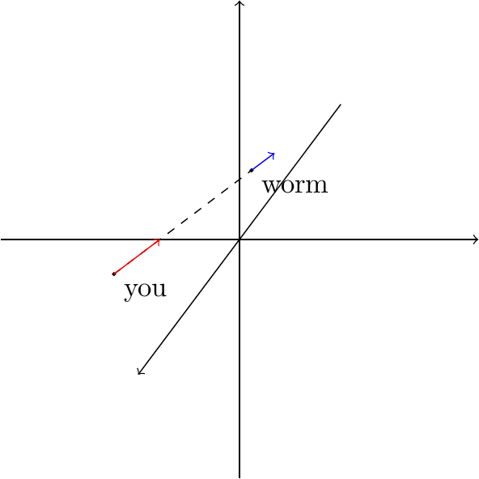
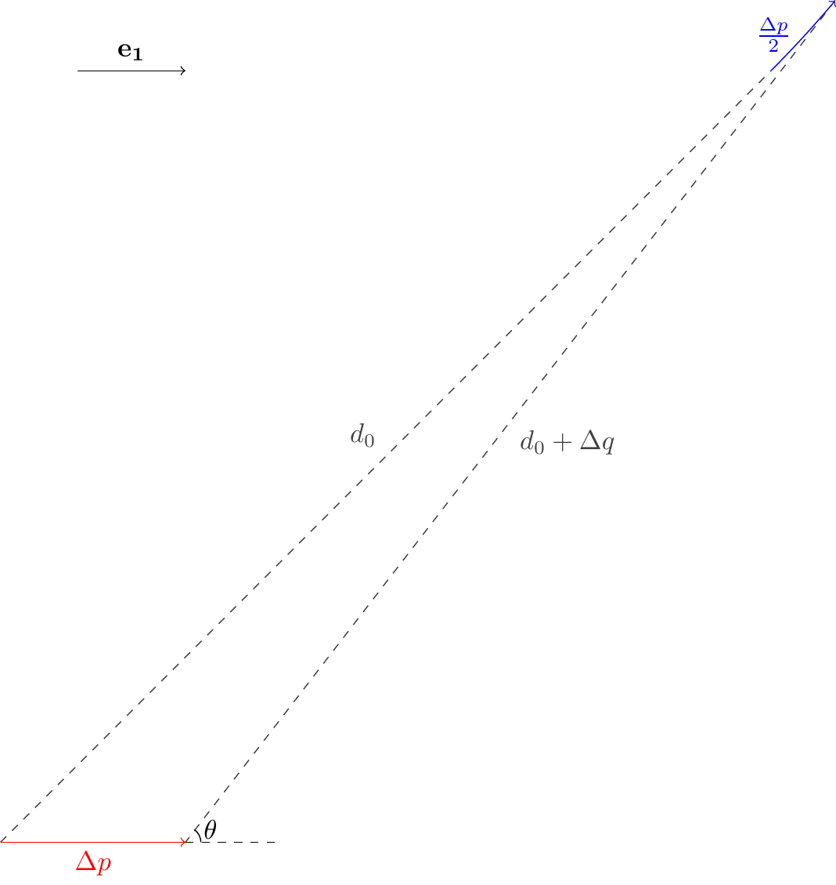

# CatchGlowworm

> 在三维空间直角坐标系中，捕虫网的初始位置是 $(0,0,0)$，而萤火虫与捕虫网的初始距离为 $[2,4]$。
>
> 捕虫网受你的控制而移动，而与此同时，萤火虫也总是朝着远离捕虫网的方向移动，此过程使用 1000 步的近似连续过程来模拟。
>
> 你的目标是，在萤火虫逃出 $x^2+y^2+z^2\le10^2$ 的范围之前，抓住萤火虫。
>
> 捕虫网与萤火虫的速度之比为 $2:1$；抓住萤火虫的判定标准为：捕虫网与萤火虫的距离不大于 $0.1$。
>
> 每回合输入你希望捕虫网移动到的位置 $(x,y,z)$，其中 $x,\,y,\,z$ 为浮点数，表示捕虫网移动的目标位置。

## 解析

本题有两种解题思路。一种是逐步试探，不断逼近萤火虫；一种是用小步位移先求解萤火虫的位置，再直接追至目标位置。两种方法都是可以的，不过要走多周目的话，还是建议求出解析解。

### 试探法

在这道题中，你只知道萤火虫的距离，而不知道具体的方向，这是很麻烦的。那么，有没有什么方法可以确定这个方向呢？当然有。

试想，如果你向某个方向前进了 $1$ 距离，而萤火虫与你的距离增加了 $1.5$，这说明什么？

只有一种情况：萤火虫和你的前进方向完全相反。



再试想，如果你向某个方向前进了 $1$ 距离，而萤火虫与你的距离减少了 $0.5$，这说明什么？当然是萤火虫和你的前进方向完全相同。



我们再来考虑更一般的情况，即，当你向某个方向前进 $\Delta p$ 时，萤火虫与你的距离变化了 $\Delta q$。

如果 $\Delta q<0$，这就说明我们正在南辕北辙，方向不对；如果 $\Delta q>0$，这就说明我们的方向确实是朝着靠近萤火虫的那一侧。$\Delta q$ 越大，就说明我们的方向越接近于真实的方向。就这样，我们可以一边调整，一边试探，不断逼近萤火虫，从而把距离缩减到 $0.1$ 以内。

### 解析法

在此之前，我们只是根据 $\Delta q$ 的大小来粗略判断「我们距离萤火虫多远」。但其实，我们更希望充分利用这份信息，判断出萤火虫的具体方向。

假设我们朝某个方向（设方向向量为 $\mathbf{e_1}$）从点 $A$ 移动到点 $B$，而萤火虫从点 $C$ 移动到点 $D$。我们可以证明 $D$ 一定在 $A,\,B,\,C$ 三点确定的平面内（因为萤火虫运动的方向向量一定平行于此平面）。

那么我们首先在这个平面内思考萤火虫的运动过程（在三维空间里描述起来还是太麻烦了点）：



在该图中，萤火虫的行动路线是个曲线；但只要 $\Delta p$ 足够小，我们就可以把它近似地当作是直线。

这样一来，$\Delta p,\,d_0+\Delta q,\,d_0+\frac{\Delta p}{2}$ 将会构成一个三角形，而这个外角 $\theta$，正是我们期望得知的「方向角」。

如何求出 $\theta$ 呢？我们可以使用余弦定理：

$$\left(d_0+\frac{\Delta p}{2}\right)^2=\Delta p^2+\left(d_0+\Delta q\right)^2-2\Delta p(d_0+\Delta q)\cos(\pi-\theta)$$

整理一下这个式子，就可以得到

$$\cos\theta=\frac{\left(d_0+\frac{\Delta p}{2}\right)^2-\Delta p^2-\left(d_0+\Delta q\right)^2}{2\Delta p\left(d_0+\Delta q\right)}$$

现在我们知道了方向和距离，那么就能在平面上确定两个点（因为我们尚不知晓 $\theta$ 的正负），这两个点就是萤火虫可能位置的近似解。

然而，在三维空间中我们无法根据现有的信息判断「这个平面在哪」，因此我们得到的结果只能说明萤火虫可能的位置在一个圆环上。

接下来我们再选择一个与 $\mathbf{e_1}$ 线性无关的方向向量 $\mathbf{e_2}$，重复以上工作，得到另一组解。两个圆至多只有两个交点，这是一个巨大的进展。

接下来我们再选择一个与 $\mathbf{e_1,\,e_2}$ 线性无关的方向向量 $\mathbf{e_3}$，重复以上工作，得到另一组解。**三个圆至多只有一个交点，这就是我们需要的解！**

以上只是对可行性的阐述；而实际上我们没必要真的在空间中求三个圆的交点。我选择的方案是：**投影**。

我们通过在 $\mathbf{e_1}$ 方向上的运动能够得到一组解，那是一个圆环。我们不能确定萤火虫在圆环上的哪个位置；但有一件事是确定的，那就是它的位置在 $\mathbf{e_1}$ 方向上的投影。

举个例子，如果我们向 $x$ 轴正方向移动了 $\Delta p$，据此求出的角度是 $\theta$，那岂不就是说，萤火虫的位置在 $x$ 轴的投影就是 $\Delta p+\left(d_0+\Delta q\right)\cos\theta$ 吗？

同样的道理，如果我们再分别向 $y$ 轴和 $z$ 轴移动一小段距离的话，我们也可以求出萤火虫位置在 $y$ 轴和 $z$ 轴上的投影。这样一来，**我们就完全求出了萤火虫的位置！**那么接下来的问题就迎刃而解了！

#### 误差分析

现在我们来做一点误差分析。

本题的要求比较松，只要距离在 $0.1$ 以内都可以判定为通关，所以我们对计算误差的可接受范围就是 $0.1$。

哪些地方产生了误差呢？

首先是，**我们假设当 $\Delta p$ 很小时，萤火虫的运动近似于直线**。

曲线运动带来的误差是很难估计的，但我们可以为它估计一个上界。


萤火虫偏转的角度约等于此图中的 $\alpha$。而当 $\Delta p$ 足够小的时候，我们可以粗略认为 $\alpha\approx\frac{\Delta p\cos\theta}{d_0}\le\frac{\Delta p}{d_0}$。

而萤火虫走过的距离为 $\frac{\Delta p}2$，它的位置误差不会超过半径为 $\frac{\Delta p}2$，弧度为 $\alpha$ 的扇形区域，也就是 $\frac{\Delta p^2}{2d_0}$。

假如说我取 $\Delta p=10^{-3}$，那么这个误差大概会到达 $10^{-7}$ 量级，可以说是完全没有影响了。

另一个误差来源在于：**我们分别测定 $x,\,y,\,z$ 坐标时必然存在次序；当我们测定其中一个值时，必须要让萤火虫运动起来，那么我们先前测定好的值就不准确了。**

假设我们的测定顺序是 $x,\,y,\,z$，而我们每次都移动 $\Delta p$ 距离，那么 $x$ 轴上的误差积累了两回合，也就是不超过 $\Delta p$；$y$ 轴上的误差积累了一回合，不超过 $\frac{\Delta p}{2}$；而 $z$ 轴上，我们姑且认为没有误差。

所以累积误差是多少呢？不超过 $\frac{\sqrt5\Delta p}2$。所以只要 $\Delta p$ 取得较小，我们就可以尽量避免出现很大的误差。

不过，**也不是说 $\Delta p$ 就要取得越小越好**。本题的浮点数精度只有七位有效数字，换句话说，即便是 $\Delta q$ 在数值上有 $10^{-12}$ 的差异，经过四舍五入之后都有可能放大到 $10^{-6}$ 大小。如果你用 $10^{-6}$ 量级的 $\Delta p$ 来测定结果的话，那么这个结果的准确度反而要大打折扣了。

#### 示例代码

下面的 Python 代码是我测题时使用的，可供参考：

```python
import sys
rate=.5
delta=.001
d0=float(sys.argv[1])//初始状态下的距离
d1=float(sys.argv[2])//向x轴方向移动delta后的距离
d2=float(sys.argv[3])//向y轴方向移动delta后的距离
d3=float(sys.argv[4])//向z轴方向移动delta后的距离
dx=d3*((d0+rate*delta)**2-delta**2-d1**2)/(2*delta*d1)//相对距离在x方向上的投影
dy=d3*((d1+rate*delta)**2-delta**2-d2**2)/(2*delta*d2)//相对距离在y方向上的投影
dz=d3*((d2+rate*delta)**2-delta**2-d3**2)/(2*delta*d3)//相对距离在z方向上的投影
x=2*dx+delta
y=2*dy+delta
z=2*dz+delta
print(f'{x} {y} {z}')//前往此处即可抓到萤火虫
```

#### 算法简化

脉冲星为我提供了一个更简单的思路，如图所示：


在这里，我们根本没必要求出哪个具体的角度，只需要在两个直角三角形中根据勾股定理列出如下方程组：

$$\begin{cases}
x^2+r^2=d_1^2\\
(x+\Delta p)^2+r^2=\left(d_0+\frac{\Delta p}2\right)^2
\end{cases}$$

便可以解出 $x=\frac{\left(d_0+\frac{\Delta p}2\right)^2-\Delta p^2-d_1^2}{2\Delta p}$。这就是萤火虫与你在 $x$ 轴上的相对距离。

另外两步也可以如法解出，它的思路比使用余弦定理更简洁，但没有本质上的区别。
